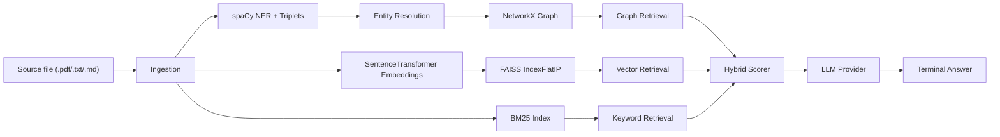

# GraphMind: Terminal Hybrid Knowledge-Graph & Vector RAG

GraphMind is a local terminal-based retrieval system for asking questions over your own knowledge base. It ingests `.pdf`, `.txt`, or `.md` files, builds a knowledge graph plus FAISS/BM25 indexes, and answers questions through a hybrid retriever.

## Architecture



## Features

| Capability           | Implementation                                             |
| -------------------- | ---------------------------------------------------------- |
| Source ingestion     | Supports `.pdf`, `.txt`, and `.md`.                        |
| Chunking             | Deterministic sentence-window chunking with overlap.       |
| Entity deduplication | Canonical graph node resolution using string similarity.   |
| Hybrid retrieval     | Vector search, BM25 keyword search, and graph traversal.   |
| Concurrent retrieval | Retrieval paths run in parallel with `ThreadPoolExecutor`. |
| LLM providers        | `ollama`, `openai`, or `gemini` via `.env`.                |

## Setup

```powershell
python -m venv .venv
.\.venv\Scripts\activate
pip install -r requirements.txt
python -m spacy download en_core_web_sm
copy .env.example .env
```

For local Ollama:

```powershell
ollama pull llama3.2
```

## Configure LLM

Edit `.env`.

For Ollama:

```env
LLM_PROVIDER=ollama
LLM_MODEL=llama3.2
```

For Gemini:

```env
LLM_PROVIDER=gemini
LLM_MODEL=gemini-3.5-flash
GEMINI_API_KEY=your_key_here
```

For OpenAI:

```env
LLM_PROVIDER=openai
LLM_MODEL=gpt-4o-mini
OPENAI_API_KEY=your_key_here
```

## Add Your Knowledge Base

Put your source files inside `knowledge_base/`:

```text
knowledge_base/
  notes.pdf
  notes.txt
  notes.md
```

Then build the artifacts:

```powershell
python ingestion.py
python graph_engine.py
python vector_engine.py
```

To ingest a specific file or another folder:

```powershell
python ingestion.py --input path\to\file.pdf
python ingestion.py --input path\to\folder
```

Generated files are written to `data/`:

| Artifact             | Purpose                                   |
| -------------------- | ----------------------------------------- |
| `chunks.pkl`         | Chunk text and entity metadata.           |
| `triplets.pkl`       | Extracted subject-predicate-object facts. |
| `graph.pkl`          | NetworkX graph.                           |
| `faiss_index.bin`    | Vector index.                             |
| `chunk_map.pkl`      | FAISS ID to chunk ID map.                 |
| `inverted_index.pkl` | BM25 keyword index.                       |

## Ask Questions

```powershell
python demo.py
```

Type your question and press Enter. Press Enter on a blank prompt to exit.

## Repository Layout

```text
graphrag/
  demo.py             Terminal question-answering interface
  ingestion.py        Source loading, chunking, NER, triplet extraction
  graph_engine.py     Entity resolution and knowledge graph construction
  vector_engine.py    FAISS vector index and BM25 index build
  retriever.py        Concurrent hybrid retrieval and LLM provider routing
  neo4j_export.py     Optional graph export to Neo4j
  knowledge_base/     Put local .pdf/.txt/.md files here
  requirements.txt    Runtime dependencies
  .env.example        Configuration template
```
